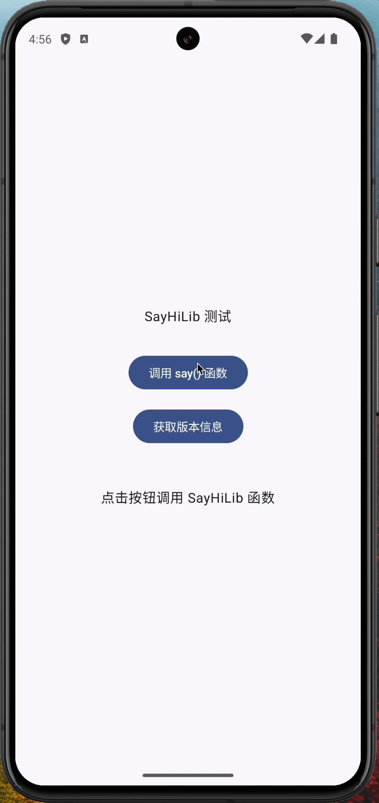
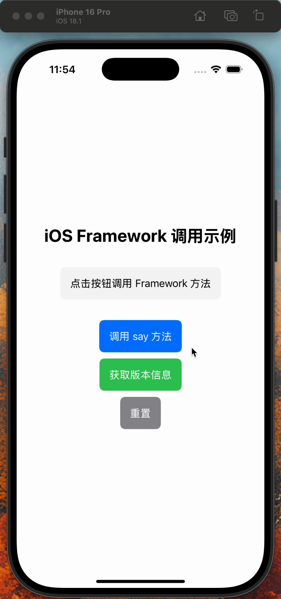
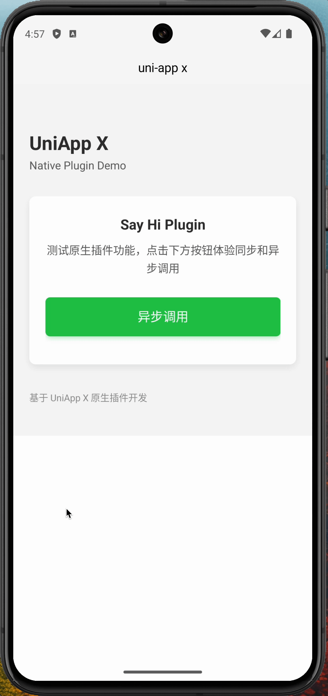
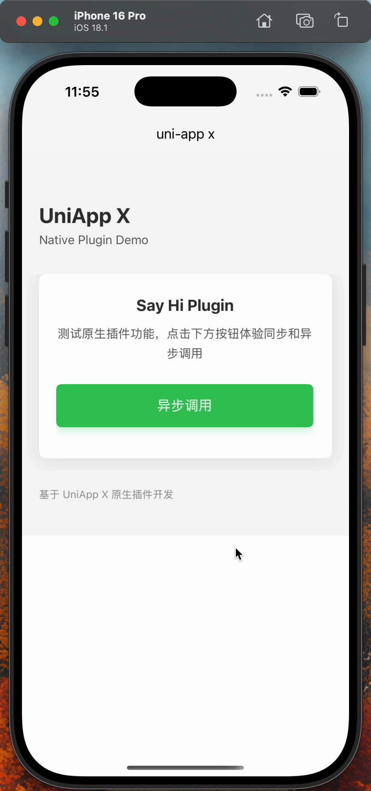

# UniApp X 原生插件开发示例

这是一个完整的 UniApp X 原生插件开发示例项目，展示了如何通过 UTS 调用原生库文件，实现跨平台的原生功能集成。

## 📸 项目演示

### 原生功能演示
| Android 原生库测试 | iOS 原生框架测试 |
|-------------------|------------------|
|  |  |

### UniApp X 集成演示
| Android 平台调用 | iOS 平台调用 |
|-----------------|--------------|
|  |  |

**演示说明：**
- **原生演示**：展示在 Android Studio 和 Xcode 中独立运行原生库的功能
- **UniApp X 集成**：展示在 UniApp X 应用中调用原生插件的完整流程
- **跨平台一致性**：验证 Android 和 iOS 平台的功能表现一致

## 🎯 项目特色

- **原生优先开发**：先在原生平台（Android/iOS）上调试好功能，再移植到 UniApp X 中
- **现代化技术栈**：使用 Kotlin 和 Swift 开发原生库，学习价值更高
- **完整开发流程**：从原生库开发到 UTS 插件封装，再到 UniApp X 应用集成
- **跨平台兼容**：支持 Android 和 iOS 双平台

## 📁 项目结构

```
starter-uniapp-native-plugin/
├── android-playground/          # Android 原生库项目
│   ├── android-lib/            # Android 库模块
│   ├── app/                    # Android 测试应用
│   ├── build-aar.sh            # Android AAR 构建脚本 (Linux/macOS)
│   └── build-aar.bat           # Android AAR 构建脚本 (Windows)
├── ios-framework/              # iOS 原生框架项目
│   ├── ios-framework/          # iOS Framework 源码
│   ├── build-framework.sh      # iOS Framework 构建脚本
│   └── BUILD.md                # iOS Framework 构建说明
├── ios-playground/             # iOS 测试应用
├── uniapp-x-playground/        # UniApp X 应用
│   └── uni_modules/
│       └── say-hi/             # UTS 插件模块
└── screenshots/                # 项目截图和演示
```

## 🚀 快速开始

### 1. 环境要求

- HBuilderX 3.6.8+
- Android Studio (用于 Android 开发)
- Xcode (用于 iOS 开发)
- UniApp X 3.1.0+

### 2. 构建原生库

项目提供了多种方式来构建 Android AAR 包和 iOS Framework，支持不同环境：

#### 构建 Android AAR 包

**使用构建脚本 (推荐)**

**Linux/macOS:**
```bash
# 进入 Android 项目目录
cd android-playground

# 构建 debug 版本 (默认)
./build-aar.sh

# 构建 release 版本
./build-aar.sh -e release

# 构建混淆的 release 版本
./build-aar.sh -e release-minified

# 清理缓存后构建
./build-aar.sh -e release -c

# 查看帮助
./build-aar.sh -h
```

**Windows:**
```cmd
# 进入 Android 项目目录
cd android-playground

# 构建 debug 版本 (默认)
build-aar.bat

# 构建 release 版本
build-aar.bat -e release

# 构建混淆的 release 版本
build-aar.bat -e release-minified

# 清理缓存后构建
build-aar.bat -e release -c
```

#### 构建 iOS Framework

**使用构建脚本 (推荐)**

```bash
# 进入 iOS Framework 项目目录
cd ios-framework

# 构建 Release 通用版本 (默认)
./build-framework.sh

# 构建 Debug 通用版本
./build-framework.sh -c Debug

# 仅构建模拟器版本
./build-framework.sh -s

# 仅构建设备版本
./build-framework.sh -d

# 构建通用版本 (模拟器+设备)
./build-framework.sh -u

# 清理缓存后构建
./build-framework.sh --clean

# 查看帮助
./build-framework.sh -h
```


#### 使用 Gradle 命令

```bash
# 进入 Android 项目目录
cd android-playground

# 构建 debug 版本
./gradlew :android-lib:assembleDebug

# 构建 release 版本
./gradlew :android-lib:assembleRelease

# 清理构建缓存
./gradlew clean
```

#### 使用 Xcode 命令

```bash
# 进入 iOS Framework 项目目录
cd ios-framework

# 构建 Release 版本
xcodebuild build -project ios-framework.xcodeproj -scheme ios-framework -configuration Release -sdk iphoneos

# 构建 Debug 版本
xcodebuild build -project ios-framework.xcodeproj -scheme ios-framework -configuration Debug -sdk iphoneos

# 构建模拟器版本
xcodebuild build -project ios-framework.xcodeproj -scheme ios-framework -configuration Release -sdk iphonesimulator

# 清理构建缓存
xcodebuild clean -project ios-framework.xcodeproj -scheme ios-framework
```

### 3. 运行示例

#### Android 平台
```bash
# 1. 打开 Android Studio，导入 android-playground 项目
# 2. 构建并运行 android-lib 模块
# 3. 运行 app 模块测试原生功能
```

#### iOS 平台
```bash
# 1. 打开 Xcode，导入 ios-framework 项目
# 2. 构建框架
# 3. 运行 ios-playground 测试原生功能
```

#### UniApp X 应用
```bash
# 1. 使用 HBuilderX 打开 uniapp-x-playground 项目
# 2. 运行到 Android 或 iOS 设备/模拟器
# 3. 点击"异步调用"按钮测试插件功能
```

## 🔧 开发流程

### 1. AAR 包构建说明

#### 构建环境说明

**Android 构建配置：**
- **debug**: 调试版本，包含调试信息，文件较大，适合开发阶段使用
- **release**: 发布版本，优化后的代码，文件较小，适合生产环境
- **release-minified**: 混淆版本，代码经过混淆和压缩，文件最小，适合最终发布

**iOS 构建配置：**
- **Debug**: 调试版本，包含调试信息，文件较大，适合开发阶段使用
- **Release**: 发布版本，优化后的代码，文件较小，适合生产环境

**iOS 构建类型：**
- **simulator**: 仅构建模拟器版本，支持 x86_64 和 arm64 架构
- **device**: 仅构建设备版本，支持 arm64 架构
- **universal**: 构建通用版本，同时支持模拟器和设备，文件较大但兼容性最好

#### 构建输出

**Android AAR 包输出：**
构建完成后，AAR 文件将生成在：
```
android-playground/android-lib/build/outputs/aar/
├── android-lib-debug.aar      # Debug 版本
├── android-lib-release.aar    # Release 版本
└── android-lib-release.aar    # Release-minified 版本 (混淆后)
```

**iOS Framework 输出：**
构建完成后，Framework 文件将生成在：
```
ios-framework/build/Release/
├── ios_framework.framework           # 通用版本 (模拟器+设备)
├── ios_framework-simulator.framework # 模拟器版本
└── ios_framework-device.framework    # 设备版本
```

#### 自动复制到 UniApp 项目

**Android AAR 包：**
构建脚本会自动将生成的 AAR 文件复制到 UniApp 项目中：
```
uniapp-x-playground/uni_modules/say-hi/utssdk/app-android/libs/
```

**iOS Framework：**
构建脚本会自动将生成的 Framework 文件复制到 UniApp 项目中：
```
uniapp-x-playground/uni_modules/say-hi/utssdk/app-ios/Frameworks/
```

### 2. 原生库开发

#### Android (Kotlin)
```kotlin
// android-playground/android-lib/src/main/java/com/hens/android_lib/SayHiLib.kt
public class SayHiLib {
    public fun say(str: String): String {
        val currentTime = Date()
        val formatter = SimpleDateFormat("yyyy-MM-dd HH:mm:ss", Locale.getDefault())
        val timeString = formatter.format(currentTime)
        
        return "Hi! 你发送的消息是: '$str'\n当前时间: $timeString"
    }
}
```

#### iOS (Swift)
```swift
// ios-framework/ios-framework/ios_framework.swift
public class SayHiFramework {
    public func say(_ str: String) -> String {
        let currentTime = Date()
        let formatter = DateFormatter()
        formatter.dateFormat = "yyyy-MM-dd HH:mm:ss"
        let timeString = formatter.string(from: currentTime)
        
        return "Hi! 你发送的消息是: '\(str)'\n当前时间: \(timeString)"
    }
}
```

### 2. UTS 插件开发

#### 接口定义
```typescript
// uniapp-x-playground/uni_modules/say-hi/utssdk/interface.uts
export type SayHiApiOptions = {
  say : string
  success ?: (res : SayHiApiResult) => void
  fail ?: (res : SayHiApiFail) => void
  complete ?: (res : any) => void
}

export type SayHiApiResult = {
  result : string
}
```

#### Android 实现
```typescript
// uniapp-x-playground/uni_modules/say-hi/utssdk/app-android/index.uts
import SayHiLib from 'com.hens.android_lib.SayHiLib';

export const sayHiApi : SayHiApi = function (options : SayHiApiOptions) {
  const sayHiLib = new SayHiLib();
  const result = sayHiLib.say(options.say);
  
  const res : SayHiApiResult = {
    result: result
  };
  options.success?.(res);
  options.complete?.(res);
}
```

#### iOS 实现
```typescript
// uniapp-x-playground/uni_modules/say-hi/utssdk/app-ios/index.uts
import { SayHiFramework } from 'ios_framework';

export const sayHiApi : SayHiApi = function (options : SayHiApiOptions) {
  const sayHi = new SayHiFramework()
  const result = sayHi.say(options.say)
  options.success?.({result})
}
```

### 3. UniApp X 应用集成

```vue
<!-- uniapp-x-playground/pages/index/index.uvue -->
<template>
  <view class="container">
    <view class="button-group">
      <view class="btn btn-secondary" @click="onSayHi">
        <text class="btn-text">异步调用</text>
      </view>
    </view>
    
    <view class="result-card" v-if="resultMessage">
      <text class="result-content">{{ resultMessage }}</text>
    </view>
  </view>
</template>

<script>
import { sayHiApi } from "@/uni_modules/say-hi";

export default {
  data() {
    return {
      resultMessage: ''
    }
  },
  methods: {
    onSayHi(){
      this.resultMessage = '正在异步调用...'
      sayHiApi({
        say: 'hi',
        success: (res) => {
          this.resultMessage = `异步调用成功: ${JSON.stringify(res)}`
        },
        fail: (error) => {
          this.resultMessage = `异步调用失败: ${JSON.stringify(error)}`
        }
      })
    }
  }
}
</script>
```

## 📱 功能演示

项目包含完整的演示应用，展示了：

- ✅ 原生库的独立开发和测试
- ✅ UTS 插件的封装和接口定义
- ✅ UniApp X 应用的集成和使用
- ✅ 异步调用的完整流程
- ✅ 错误处理和回调机制

## 🛠️ 开发优势

1. **原生调试便利**：可以在原生 IDE 中独立调试功能
2. **技术栈现代化**：使用 Kotlin 和 Swift，学习价值更高
3. **开发效率提升**：原生功能开发完成后，UTS 集成相对简单
4. **跨平台一致性**：通过 UTS 统一接口，保证双平台行为一致

## 📚 相关文档

- [UTS 语法文档](https://uniapp.dcloud.net.cn/tutorial/syntax-uts.html)
- [UTS API插件开发](https://uniapp.dcloud.net.cn/plugin/uts-plugin.html)
- [UTS uni-app兼容模式组件](https://uniapp.dcloud.net.cn/plugin/uts-component.html)
- [UTS 标准模式组件](https://doc.dcloud.net.cn/uni-app-x/plugin/uts-vue-component.html)
- [Hello UTS 示例项目](https://gitcode.net/dcloud/hello-uts)

## 🤝 贡献指南

欢迎提交 Issue 和 Pull Request 来改进这个项目。

## 📄 许可证

本项目采用 MIT 许可证。

---

**注意**：本项目主要解决了 UniApp X 与原生库的通信问题，具体的业务模块需要根据实际需求进行开发。AI 可以协助解决部分开发问题，但复杂的功能实现仍需要领域知识和开发经验。
